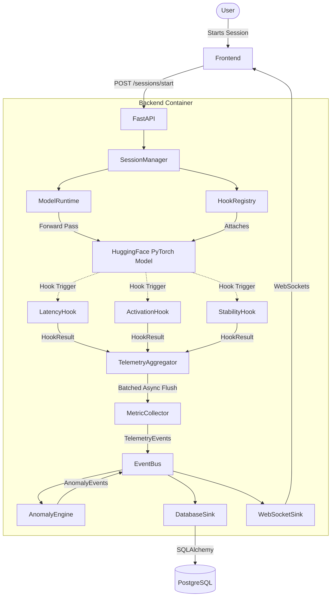

# Architecture Overview

This document outlines the architecture of the Local LLM Instrumentation Platform. The primary challenge this architecture solves is **bridging the synchronous, blocking nature of PyTorch with the asynchronous, non-blocking nature of modern WebSockets and UI updates**, all while preventing VRAM exhaustion.

## System Flow Diagram

## Component Breakdown

1.  **Frontend (React/Vite)**: Polls `/health`, establishes WebSockets for live data, and uses Shadcn-UI for rendering advanced telemetry charts.
2.  **FastAPI**: The entry point. Manages session lifecycles and routes WebSocket connections via `ConnectionManager`.
3.  **ModelRuntime & Adapters**: Standardizes HuggingFace `PreTrainedModel` boundaries. Ensures that models like `Llama` and `GPT-2` present uniform layer topologies (e.g., `adapter.get_transformer_blocks()`).
4.  **HookRegistry**: Mounts native PyTorch `register_forward_hook` directly onto the resolved topologies.
5.  **TelemetryAggregator**: The safety valve. A thread-safe queue operating synchronously within the PyTorch forward pass, utilizing `asyncio.run_coroutine_threadsafe` to bridge the GIL and drop batches onto the EventBus every 500ms.
6.  **EventBus**: A strict Pub/Sub message broker routing explicitly typed Pydantic models (e.g., `ActivationEvent`, `TokenEvent`).
7.  **Sinks**: The endpoints of the telemetry pipeline. The `WebSocketSink` broadcasts globally, while the `DatabaseSink` handles SQL persistence in the background.
